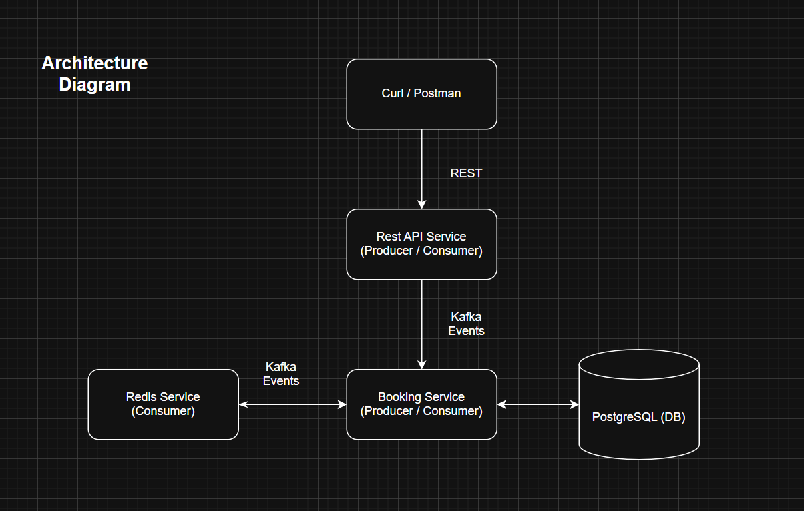
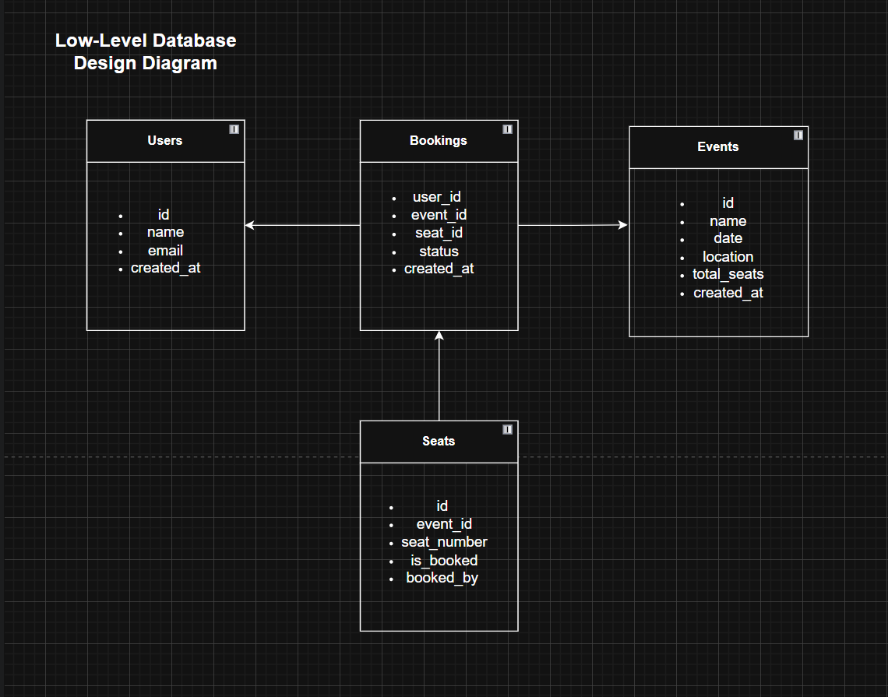

# 🎟️ Event based Ticket Booking System - Python

## ✅ Overview
A event-based, real-time ticket booking system designed to handle high concurrency, providing fair, first-come-first-serve seat allocation for events such as concerts or conferences.

---

##  System Design Documentation

📷 **Architecture Diagram:**  


### 🔸 Design Highlights:
- Event based
- Clear separation of concerns
- Redis cache + transactional DB write

### 🔸 Failure Handling:
- Redis is used for performance, not persistence
- Kafka ensures async operations won’t block core booking logic
- Errors in one system don’t affect others

### 🔸 Scalability Strategy:
- Stateless API allows horizontal scaling
- Redis + Kafka reduce bottlenecks

---

##  Low-Level Database Design Diagram

The system uses PostgreSQL for structured booking data with proper relationships and indexes to ensure high performance.

- Tables:
  - `users(id, name, email, created_at)`
  - `events(id, name, date, location, total_seats, created_at)`
  - `seats(id, event_id, seat_number, is_booked, booked_by)`
  - `bookings(id, user_id, event_id, seat_id, status, created_at)`

- Indexes:
  - `seats(event_id, seat_number)` → for seat lookup
  - `bookings(user_id)` → for user-specific fetches

📷 **Diagram:**  


---

##  Queueing Mechanism for First-Come-First-Serve Booking

The system ensures FCFS fairness using:

- **Kafka:**
  - Handles all fuctions event based - no direct api calls to tigger functions
  - Handles async updates after booking is complete.
  - Ensures booking process stays fast and non-blocking.
  - Handles redis cache updation.

- **Redis-based locking:**
  - Before attempting a DB transaction, a Redis key lock is applied (e.g., `event:1:seat:A1`).
  - If the key exists, the seat is already being processed → user receives "already booked" error.

- **Transactional Booking:**
  - PostgreSQL transaction ensures the seat is marked booked + booking is created atomically.

---

##  Real-Time Seat Availability Updates

The system provides real-time UI updates through:

- **Redis:**
  - Seat availability is stored as key-value pairs.

---

##  Scalability & Resilience Strategy

- **Scalability:**
  - All the services are running individually and can be horizontally scaled.
  - Redis handles fast seat lookups to reduce DB load.
  - Kafka allows decoupling and makes it entirely event based.
  - PostgreSQL connection pooling optimizes DB performance.

- **Resilience:**
  - Redis: If unavailable, falls back to DB (less performant).
  - Kafka: Supports retries, fault-tolerant message delivery.
  - Booking: DB transactions protect data integrity.
  - Docker + Kubernetes: Allows for resilient container orchestration.

---


## 🧰 Try it Out & Useful cURL Commands

> 💡 Please note: Due to resource constraints on the Raspberry Pi 5, **no stress testing or high-volume concurrency testing is requested**.

The app is publicly accessible via a secure **Cloudflare ZeroTrust tunnel** at:  
🔗 [https://tbspy.watevr.co.in](https://tbspy.watevr.co.in)

### Public Demo - cURL Commands

#### Book a Ticket:
```bash
curl -X POST -H "Content-Type: application/json" \
  -d '{"user_id": 1, "event_id": 1, "seat_ids": [1,2]}' \
  https://tbspy.watevr.co.in/bookings/book
```

#### Cancel a Booking:
```bash
curl -X DELETE "https://tbspy.watevr.co.in/bookings/cancel/1?event_id=1&seat_id=1"
```

#### Fetch User Bookings:
```bash
curl https://tbspy.watevr.co.in/bookings/user/1
```

#### Fetch Seats of a particualr Event:
```bash
curl https://tbspy.watevr.co.in/events/seats/1
```

#### Fetch Seats of all the Events:
```bash
curl "https://tbspy.watevr.co.in/events/seats/*"
```

### Running Locally
If you want to run this project locally:

1. Clone the repo:
```bash
git clone https://github.com/islamshahil/event-based-ticket-booking-system.git
cd event-based-ticket-booking-system
```

2. Start required services (Redis, PostgreSQL, Kafka) via Docker or manually.
3. Create the topic `booking-topic` in Kafka manually.
4. Use the provided `database-schema.sql` to create tables in PostgreSQL.
5. Insert dummy data using sample queries inside `db/seed.sql` (or similar).
6. Copy `.env-example` to `.env` and update values accordingly.
7. Run the application:
```bash
docker-compose up --build -d
```

---

## 🐳 Dockerization & Deployment

### Version Control & Manual Deployment:
- GitHub is used for source code version control.
- Due to time constraints, a CI/CD pipeline has not been set up.
- The application is deployed manually using:
```bash
git pull origin main
sudo docker-compose up --build -d
```

- Redis, PostgreSQL, and Kafka are all running as separate Docker containers on a Raspberry Pi 5.
- The application is Dockerized and configured via shared `.env` file.
- Three seperate docker service will start: rest-service, event-service, cache-service.
- Publicly exposed using Cloudflare ZeroTrust.

---

## 🚀 Future Enhancements

- The system currently uses a hybrid of REST APIs and Kafka.
- A full migration to a **fully event-driven architecture** is planned where:
  - All state changes are communicated via Kafka topics.
  - Microservices become reactive and decoupled.

### Additional Features in Roadmap:
- Unit test
- Rate limiting and schema validation
- GitHub Actions for CI/CD
---

## ✅ Conclusion
A fully containerized, real-time ticket booking system that's scalable, fault-tolerant, and production ready!

